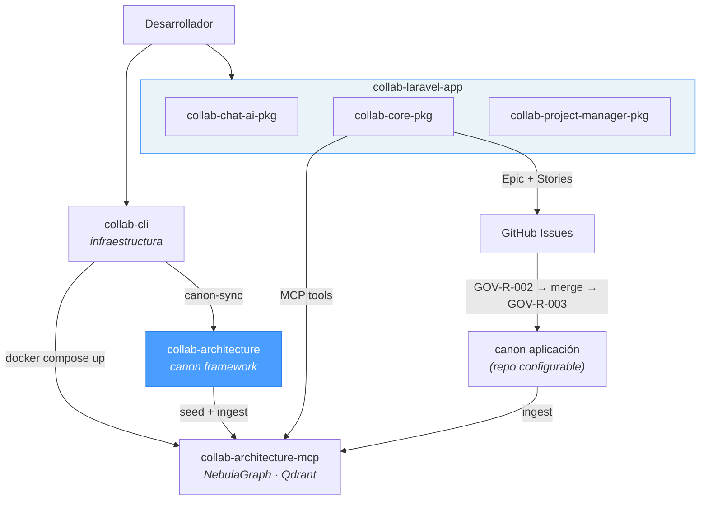

# Collab Architecture

Collab Architecture es la memoria arquitectónica canónica de los sistemas UxmalTech. Es un repositorio de conocimiento que define cómo se diseñan, restringen y evolucionan los sistemas dentro del ecosistema Collab. No contiene código fuente de aplicaciones y no describe ninguna implementación particular.

Los agentes LLM usan este repositorio como memoria persistente. El canon está estructurado para soportar razonamiento basado en grafos y recall semántico basado en vectores. Si una regla, patrón o decisión no está presente aquí, no es parte de la arquitectura UxmalTech.

Separación estricta:
- El código fuente de aplicaciones vive **fuera** de este repositorio.
- El conocimiento arquitectónico, reglas y decisiones viven **dentro** de este repositorio.

Regla gobernante:
> "If it is not in Collab Architecture, it is not a rule yet."

## Ecosistema Collab



| Repositorio | Rol | Relación con este repo |
|-------------|-----|----------------------|
| [`collab-cli`](https://github.com/uxmaltech/collab-cli) | Orquestador CLI | Lee el canon, levanta infraestructura, sincroniza cambios |
| **`collab-architecture`** | **Fuente de verdad** | **Este repositorio — define reglas, patrones y decisiones** |
| [`collab-architecture-mcp`](https://github.com/uxmaltech/collab-architecture-mcp) | Servidor MCP | Expone el canon como grafo + vectores a los agentes IA |

## Modos de operación

Los archivos `.md` y `.yaml` son siempre la fuente de verdad; los índices de grafo y vectores son artefactos derivados que pueden reconstruirse en cualquier momento.

| Modo | Descripción | Infraestructura | Caso de uso |
|------|-------------|-----------------|-------------|
| **file-only** | Los agentes leen los `.md` directamente | Ninguna | Canons pequeños, proyectos single-repo, sin Docker |
| **indexed** | Los agentes consultan NebulaGraph + Qdrant vía MCP | Docker (NebulaGraph, Qdrant, MCP server) | Canons grandes, ecosistemas multi-repo |

**Heurística de transición:** Cuando el canon supera ~50,000 tokens (~375 archivos), considerar modo indexed. Al 2026-03-01, el canon contiene ~7,300 tokens en 76 archivos — dentro del rango file-only.

**Disaster recovery:** Los archivos `.md` son canónicos. Si se pierde el grafo o los vectores, ejecutar los scripts de seed desde `collab-architecture-mcp` para reconstruir desde los archivos fuente.

## Estructura del repositorio

| Directorio | Contenido | Ejemplo de IDs |
|-----------|-----------|---------------|
| `knowledge/` | Axiomas, decisiones (ADR), convenciones, anti-patrones globales | AX-001, ADR-006, CN-001, AP-001 |
| `domains/` | Principios, reglas, patrones y anti-patrones por dominio | DOM-001, BO-R-001, CBQ-PAT-003 |
| `contracts/` | Contratos versionados UI-to-backend | UIC-001, UIC-002 |
| `graph/` | Schema NebulaGraph y datos de seed | `seed/schema.ngql`, `seed/data.ngql` |
| `schema/` | Schemas de validación (grafo, vectores, contratos) | `graph.schema.yaml` |
| `embeddings/` | Configuración de ingestion y fuentes de vectores | `sources.yaml` |
| `prompts/` | Prompts para agentes de fase, temáticos y Codex | `agents/impl-phase-1-survey-and-plan.md` |
| `governance/` | Lifecycle (GOV-R-001), implementación (GOV-R-002), canon sync (GOV-R-003) | GOV-R-001, GOV-R-002, GOV-R-003 |
| `evolution/` | Changelog canónico, guía de upgrade, deprecaciones | `changelog.md` |

## Sistema de identificadores

Cada artefacto canónico tiene un ID estable y único:

| Patrón | Tipo | Ejemplo |
|--------|------|---------|
| `AX-###` | Axioma | AX-001 Authoritative Canon |
| `ADR-###` | Decisión arquitectónica | ADR-006 Collab AI-Assisted Platform |
| `CN-###` | Convención | CN-001 Canonical Naming |
| `AP-###` | Anti-patrón global | AP-001 Architecture in Code |
| `DOM-###` | Dominio | DOM-001 Backoffice UI |
| `{DOMAIN}-R-###` | Regla de dominio | BO-R-001, CBQ-R-003, CL-R-006 |
| `{DOMAIN}-PAT-###` | Patrón de dominio | BO-PAT-001, CBQ-PAT-003 |
| `{DOMAIN}-AP-###` | Anti-patrón de dominio | BO-AP-001, CBQ-AP-003 |
| `{DOMAIN}-P-###` | Principio de dominio | BO-P-001, CBQ-P-003 |
| `UIC-###` | Contrato UI | UIC-001 GridJS List Endpoint |
| `TECH-###` | Tecnología aprobada | TECH-001 PHP |
| `GOV-R-###` | Regla de gobernanza | GOV-R-001 Implementation Process |

## Niveles de confianza

| Nivel | Descripción | Cuándo aplica |
|-------|-------------|---------------|
| `experimental` | Propuesta nueva, sin validación en producción | Ideas, ADRs iniciales, visiones |
| `provisional` | Validado parcialmente, en uso pero no consolidado | Reglas nuevas adoptadas en ≤2 repos |
| `verified` | Probado en producción y confirmado | Reglas consolidadas en múltiples repos |
| `deprecated` | Reemplazado o ya no aplica | Sustituido por un artefacto más nuevo |

## Dominios activos

| Dominio | ID | Reglas | Patrones | Anti-patrones |
|---------|-----|--------|----------|---------------|
| Backoffice UI | DOM-001 | 12 (BO-R-001..012) | 6 | 7 |
| Backend CBQ | DOM-002 | 9 (CBQ-R-001..009) | 7 | 5 |
| Cross-Layer | DOM-003 | 6 (CL-R-001..006) | 4 | 4 |

Cada dominio contiene: `principles.md`, `rules.md`, `anti-patterns.md`, `glossary.md` y un directorio `patterns/`.

## Esquema del grafo

### Tipos de nodo (9)

| Tipo | Prefijo ID | Descripción |
|------|-----------|-------------|
| Domain | DOM-### | Dominios arquitectónicos con scope y ownership |
| ArchitecturalPattern | PAT-### | Patrones canónicos que implementan reglas |
| Axiom | AX-### | Principios fundamentales inviolables |
| Rule | RL-### | Reglas de dominio con semántica enforceable |
| Decision | ADR-### | Decisiones arquitectónicas con rationale |
| AntiPattern | AP-### | Patrones prohibidos |
| Convention | CN-### | Convenciones de naming, versioning, estructura |
| UIContract | UIC-### | Contratos versionados UI↔backend |
| Technology | TECH-### | Tecnologías aprobadas |

### Tipos de arista (7)

| Tipo | Descripción |
|------|-------------|
| IMPLEMENTS | Patrón/Regla implementa algo en un Dominio/Contrato |
| DEPENDS_ON | Dependencia entre elementos arquitectónicos |
| APPLIES_TO | Regla/Axioma/Convención aplica a dominios/patrones |
| CONFLICTS_WITH | Identifica conflictos entre reglas/patrones |
| REPLACES | Versión nueva reemplaza a versión anterior |
| JUSTIFIES | Decisión/Regla justifica un Axioma/Decisión |
| USES_TECHNOLOGY | Dominio/Patrón usa una tecnología aprobada |

Los datos de seed viven en `graph/seed/` (schema.ngql, seed.ngql, data.ngql).

## Gobernanza

### Ciclo de vida de desarrollo

```
GOV-R-001 (Epic Lifecycle) → GOV-R-002 (Implementation) → GOV-R-003 (Canon Sync)
```

### GOV-R-001: Epic Lifecycle
Discovery → Epic Creation → Story Decomposition. Dirigido por el Discovery Agent (LLM vía collab-core-pkg). Crea Story Issues que alimentan GOV-R-002.

### GOV-R-002: Proceso de implementación
Proceso obligatorio de tres fases para todos los repositorios gobernados:

1. **Phase 1 — Survey & Change Plan**: Explorar codebase, detectar duplicación, proponer diseño, plan de ejecución concreto
2. **Phase 2 — Implementation**: Cambios en bloques pequeños, tests, eliminar duplicación, separación de capas
3. **Phase 3 — Repo Hygiene**: Disciplina de abstracción, legibilidad, documentación, PR checklist

Agentes compatibles: Codex (OpenAI), Claude Code (Anthropic), GitHub Copilot (opción adicional).

### GOV-R-003: Canon Sync
Post-merge: evaluar, extraer, deduplicar, escribir, validar y commitear entradas canónicas.

### Criterios de admisión al canon

- Atómico y limitado a una sola regla, patrón o decisión
- Incluir ID estable, estado, fecha de creación y nivel de confianza
- Referenciar dominio(s) aplicables
- Validado contra schemas del repositorio
- No duplicar canon existente
- Escrito en inglés exclusivamente

Documentación completa: [`governance/`](governance/)

## Servidor MCP

El servidor MCP se ha extraído a su propio repositorio: [`uxmaltech/collab-architecture-mcp`](https://github.com/uxmaltech/collab-architecture-mcp).

Endpoint default: `http://127.0.0.1:7337/mcp`

## Documentación

- [GOV-R-001 Epic Lifecycle](governance/epic-lifecycle.md) — discovery, epic creation, story decomposition
- [GOV-R-002 Implementation Process](governance/implementation-process.md) — survey & plan, implementation, repo hygiene
- [GOV-R-003 Canon Sync](governance/canon-sync.md) — extracción de aprendizajes post-merge
- [What Enters the Canon](governance/what-enters-the-canon.md) — criterios de admisión
- [Review Process](governance/review-process.md) — proceso de revisión y aprobación
- [Confidence Levels](governance/confidence-levels.md) — definición de niveles de confianza
- [Schema Versioning](schema/) — schemas de validación
- [Upgrade Guide](evolution/upgrade-guide.md) — procedimientos de upgrade cross-repo
- [Changelog](evolution/changelog.md) — timeline autoritativo de cambios al canon
- [Prompts](prompts/README.md) — modelo de tres procesos (epic, implementación, canon sync) para agentes IA

## Licencia

UNLICENSED
