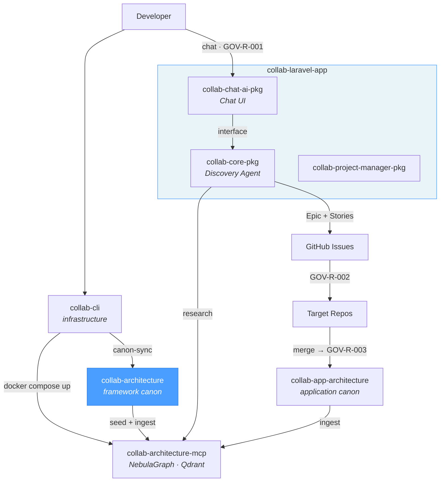

# Collab Architecture

Collab Architecture is the canonical architectural memory for UxmalTech systems. It is a knowledge repository that defines how systems are designed, constrained, and evolved within the Collab ecosystem. It contains no application source code and does not describe any particular implementation.

LLM agents use this repository as persistent memory. The canon is structured to support graph-based reasoning and vector-based semantic recall. If a rule, pattern, or decision is not present here, it is not part of the UxmalTech architecture.

Strict separation:
- Application source code lives **outside** this repository.
- Architectural knowledge, rules, and decisions live **inside** this repository.

Governing rule:
> "If it is not in Collab Architecture, it is not a rule yet."

## Collab Ecosystem



| Repository | Role | Relation to this repo |
|------------|------|----------------------|
| **`collab-architecture`** | **Framework canon** | **This repo — framework-level rules, patterns, and governance** |
| [`collab-app-architecture`](https://github.com/uxmaltech/collab-app-architecture) | Application canon | Application-specific rules, patterns, and decisions |
| [`collab-cli`](https://github.com/uxmaltech/collab-cli) | Orchestrator CLI | Infrastructure CLI — canon sync, init, domain generation |
| [`collab-architecture-mcp`](https://github.com/uxmaltech/collab-architecture-mcp) | MCP server | NebulaGraph + Qdrant — indexes canon for AI agents |
| [`collab-laravel-app`](https://github.com/uxmaltech/collab-laravel-app) | Host application | Laravel app that installs the ecosystem packages |
| [`collab-chat-ai-pkg`](https://github.com/uxmaltech/collab-chat-ai-pkg) | AI Chat package | Chat UI and prompt admin |
| [`collab-core-pkg`](https://github.com/uxmaltech/collab-core-pkg) | Issue orchestration | AI agent pipeline for issue creation |
| [`collab-project-manager-pkg`](https://github.com/uxmaltech/collab-project-manager-pkg) | Project manager | Project management functionality |

## Operation modes

The `.md` and `.yaml` files are always the source of truth; graph and vector indexes are derived artifacts that can be rebuilt at any time.

| Mode | Description | Infrastructure | Use case |
|------|-------------|----------------|----------|
| **file-only** | Agents read `.md` files directly | None | Small canons, single-repo projects, no Docker |
| **indexed** | Agents query NebulaGraph + Qdrant via MCP | Docker (NebulaGraph, Qdrant, MCP server) | Large canons, multi-repo ecosystems |

**Transition heuristic:** Consider indexed mode when the canon exceeds ~50,000 tokens (~375 files). As of 2026-03-01, the canon contains ~7,300 tokens in 76 files — within the file-only range.

**Disaster recovery:** The `.md` files are canonical. If the graph or vectors are lost, run the seed scripts from `collab-architecture-mcp` to rebuild from the source files.

## Repository structure

| Directory | Content | Example IDs |
|-----------|---------|-------------|
| `knowledge/` | Axioms, decisions (ADR), conventions, global anti-patterns | AX-001, ADR-006, CN-001, AP-001 |
| `domains/` | Principles, rules, patterns, and anti-patterns per domain | DOM-001, BO-R-001, CBQ-PAT-003 |
| `contracts/` | Versioned UI-to-backend contracts | UIC-001, UIC-002 |
| `graph/` | NebulaGraph schema and seed data | `seed/schema.ngql`, `seed/data.ngql` |
| `schema/` | Validation schemas (graph, vectors, contracts) | `graph.schema.yaml` |
| `embeddings/` | Ingestion configuration and vector sources | `sources.yaml` |
| `prompts/` | Prompts for phase agents, thematic agents, and Codex | `agents/impl-phase-1-survey-and-plan.md` |
| `governance/` | Lifecycle (GOV-R-001), implementation (GOV-R-002), canon sync (GOV-R-003) | GOV-R-001, GOV-R-002, GOV-R-003 |
| `evolution/` | Canonical changelog, upgrade guide, deprecations | `changelog.md` |

## Identifier system

Every canonical artifact has a stable, unique ID:

| Pattern | Type | Example |
|---------|------|---------|
| `AX-###` | Axiom | AX-001 Authoritative Canon |
| `ADR-###` | Architectural decision | ADR-006 Collab AI-Assisted Platform |
| `CN-###` | Convention | CN-001 Canonical Naming |
| `AP-###` | Global anti-pattern | AP-001 Architecture in Code |
| `DOM-###` | Domain | DOM-001 Backoffice UI |
| `{DOMAIN}-R-###` | Domain rule | BO-R-001, CBQ-R-003, CL-R-006 |
| `{DOMAIN}-PAT-###` | Domain pattern | BO-PAT-001, CBQ-PAT-003 |
| `{DOMAIN}-AP-###` | Domain anti-pattern | BO-AP-001, CBQ-AP-003 |
| `{DOMAIN}-P-###` | Domain principle | BO-P-001, CBQ-P-003 |
| `UIC-###` | UI contract | UIC-001 GridJS List Endpoint |
| `TECH-###` | Approved technology | TECH-001 PHP |
| `GOV-R-###` | Governance rule | GOV-R-001 Implementation Process |

## Confidence levels

| Level | Description | When it applies |
|-------|-------------|-----------------|
| `experimental` | New proposal, not validated in production | Ideas, initial ADRs, visions |
| `provisional` | Partially validated, in use but not consolidated | New rules adopted in <=2 repos |
| `verified` | Tested in production and confirmed | Rules consolidated across multiple repos |
| `deprecated` | Replaced or no longer applicable | Superseded by a newer artifact |

## Active domains

| Domain | ID | Rules | Patterns | Anti-patterns |
|--------|-----|--------|----------|---------------|
| Backoffice UI | DOM-001 | 12 (BO-R-001..012) | 6 | 7 |
| Backend CBQ | DOM-002 | 9 (CBQ-R-001..009) | 7 | 5 |
| Cross-Layer | DOM-003 | 6 (CL-R-001..006) | 4 | 4 |

Each domain contains: `principles.md`, `rules.md`, `anti-patterns.md`, `glossary.md`, and a `patterns/` directory.

## Graph schema

### Node types (9)

| Type | ID prefix | Description |
|------|-----------|-------------|
| Domain | DOM-### | Architectural domains with scope and ownership |
| ArchitecturalPattern | PAT-### | Canonical patterns that implement rules |
| Axiom | AX-### | Fundamental inviolable principles |
| Rule | RL-### | Domain rules with enforceable semantics |
| Decision | ADR-### | Architectural decisions with rationale |
| AntiPattern | AP-### | Prohibited patterns |
| Convention | CN-### | Naming, versioning, and structure conventions |
| UIContract | UIC-### | Versioned UI-backend contracts |
| Technology | TECH-### | Approved technologies |

### Edge types (7)

| Type | Description |
|------|-------------|
| IMPLEMENTS | Pattern/Rule implements something in a Domain/Contract |
| DEPENDS_ON | Dependency between architectural elements |
| APPLIES_TO | Rule/Axiom/Convention applies to domains/patterns |
| CONFLICTS_WITH | Identifies conflicts between rules/patterns |
| REPLACES | New version replaces a previous version |
| JUSTIFIES | Decision/Rule justifies an Axiom/Decision |
| USES_TECHNOLOGY | Domain/Pattern uses an approved technology |

Seed data lives in `graph/seed/` (schema.ngql, seed.ngql, data.ngql).

## Governance

### Development lifecycle

```
GOV-R-001 (Epic Lifecycle) → GOV-R-002 (Implementation) → GOV-R-003 (Canon Sync)
```

### GOV-R-001: Epic Lifecycle
Discovery → Epic Creation → Story Decomposition. Driven by the Discovery Agent (LLM via collab-core-pkg). Creates Story Issues that feed GOV-R-002.

### GOV-R-002: Implementation Process
Mandatory three-phase process for all governed repositories:

1. **Phase 1 — Survey & Change Plan**: Explore codebase, detect duplication, propose design, concrete execution plan
2. **Phase 2 — Implementation**: Small-block changes, tests, eliminate duplication, layer separation
3. **Phase 3 — Repo Hygiene**: Abstraction discipline, readability, documentation, PR checklist

Compatible agents: Codex (OpenAI), Claude Code (Anthropic), GitHub Copilot (additional option).

### GOV-R-003: Canon Sync
Post-merge: evaluate, extract, deduplicate, write, validate, and commit canonical entries.

### Canon admission criteria

- Atomic and limited to a single rule, pattern, or decision
- Include stable ID, status, creation date, and confidence level
- Reference applicable domain(s)
- Validated against repository schemas
- Does not duplicate existing canon
- Written exclusively in English

Full documentation: [`governance/`](governance/)

## MCP Server

The MCP server has been extracted to its own repository: [`uxmaltech/collab-architecture-mcp`](https://github.com/uxmaltech/collab-architecture-mcp).

Default endpoint: `http://127.0.0.1:7337/mcp`

## Documentation

- [GOV-R-001 Epic Lifecycle](governance/epic-lifecycle.md) — discovery, epic creation, story decomposition
- [GOV-R-002 Implementation Process](governance/implementation-process.md) — survey & plan, implementation, repo hygiene
- [GOV-R-003 Canon Sync](governance/canon-sync.md) — extracting learnings post-merge
- [What Enters the Canon](governance/what-enters-the-canon.md) — admission criteria
- [Review Process](governance/review-process.md) — review and approval process
- [Confidence Levels](governance/confidence-levels.md) — confidence level definitions
- [Schema Versioning](schema/) — validation schemas
- [Upgrade Guide](evolution/upgrade-guide.md) — cross-repo upgrade procedures
- [Changelog](evolution/changelog.md) — authoritative timeline of canon changes
- [Prompts](prompts/README.md) — three-process model (epic, implementation, canon sync) for AI agents

## License

UNLICENSED
