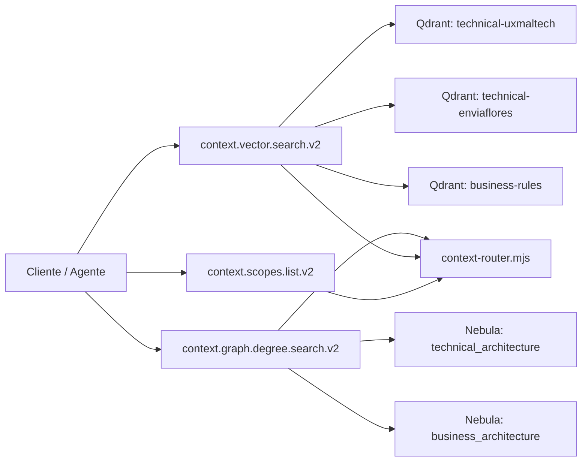

# ADR-003 Topología de Contexto V2 (Tools + Stores)

Estado: Activo  
Fecha: 2026-02-24

## Contexto
Las tools V2 deben consultar arquitectura por contexto/scope sin mezclar datos técnicos y de negocio.

## Decisión
- Mantener 3 tools V2 como superficie por defecto:
  - `context.scopes.list.v2`
  - `context.vector.search.v2`
  - `context.graph.degree.search.v2`
- Organizar Qdrant por scope técnico + dominio de negocio:
  - `technical-uxmaltech`
  - `technical-enviaflores`
  - `business-rules`
- Organizar Nebula por contexto:
  - `technical_architecture`
  - `business_architecture`

## Rationale
- **Por qué 3 colecciones en Qdrant**:
  - Separar técnico por scope mejora precisión semántica y reduce ruido entre organizaciones/scopes.
  - `business-rules` se separa porque su intención de consulta y semántica no es la misma que la del codebase técnico.
- **Por qué 2 espacios en Nebula**:
  - Un solo espacio técnico conserva dependencias cruzadas entre repos/scopes en un mismo grafo.
  - El espacio de negocio queda aislado para no mezclar relaciones técnicas con reglas/capacidades de negocio.

## Diagrama

## Consecuencias
- Aislamiento explícito técnico vs negocio.
- Ruteo por scope determinístico y auditable.
- Consultas globales técnicas sin cambiar contratos de tools.
