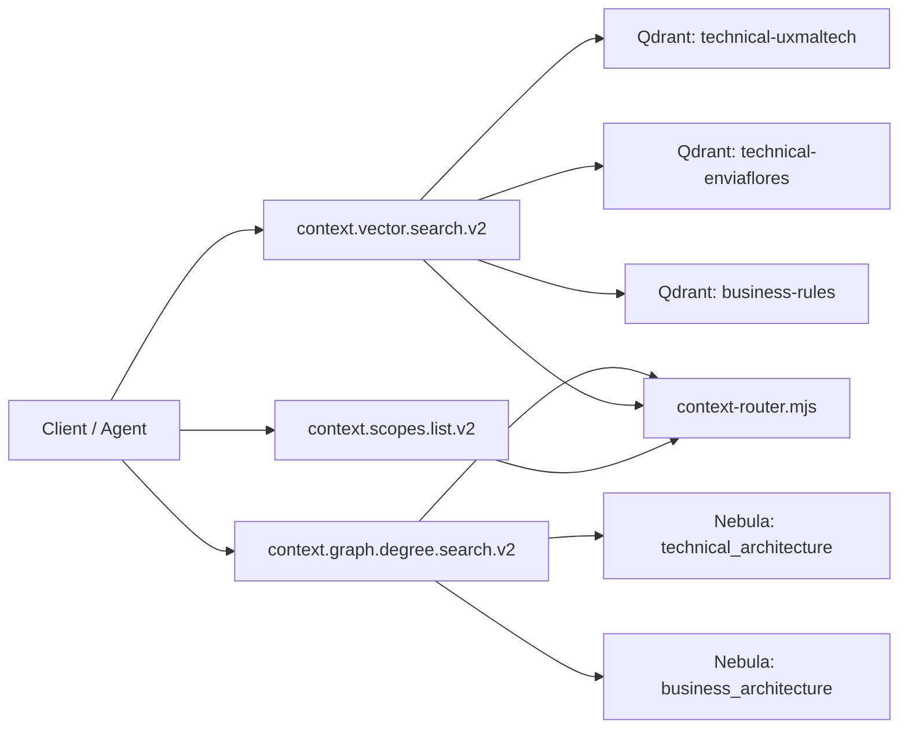

# ADR-003 V2 Context Topology (Tools + Stores)

Status: Active
Date: 2026-02-24

Context:
V2 tools must query architecture by context/scope without mixing technical and business data.

Decision:
- Keep 3 V2 tools as the default API surface:
  - `context.scopes.list.v2`
  - `context.vector.search.v2`
  - `context.graph.degree.search.v2`
- Organize Qdrant by technical scope + business domain:
  - `technical-uxmaltech`
  - `technical-enviaflores`
  - `business-rules`
- Organize Nebula by context:
  - `technical_architecture`
  - `business_architecture`

Rationale:
- Why **3 Qdrant collections**:
  - Technical vectors are partitioned by scope (`uxmaltech`, `enviaflores`) to keep retrieval precise, reduce noisy cross-scope similarity, and allow independent reindex/ops per scope.
  - Business vectors are isolated in `business-rules` because they follow a different semantic intent and query profile than technical codebase chunks.
- Why **2 Nebula spaces**:
  - Graph traversal benefits from one unified technical graph (`technical_architecture`) so cross-repo and cross-scope technical dependencies remain connected in the same topology.
  - Business relations are kept separate in `business_architecture` to preserve context boundaries and avoid mixing business semantics with technical dependency edges.

Consequences:
- Clear isolation: technical vs business remains explicit.
- Scope routing is deterministic and auditable.
- Global technical queries can aggregate collections without changing tool contracts.
- Storage naming now matches context semantics (`technical-*`).
