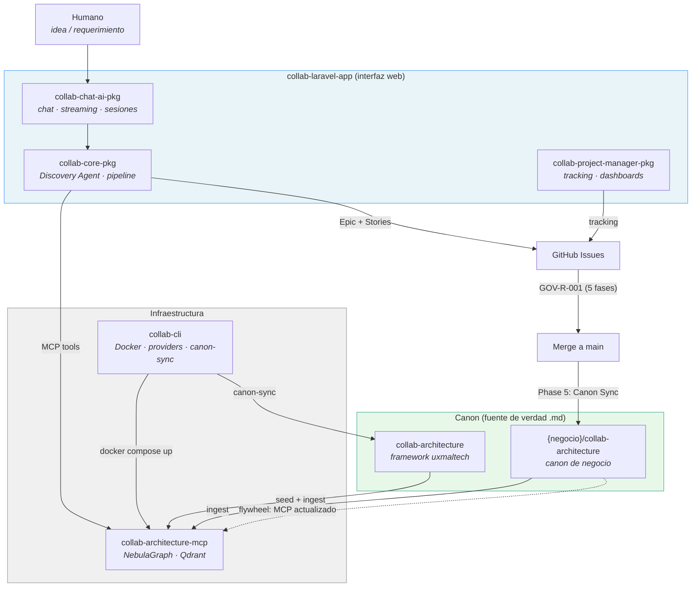
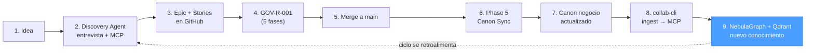

# ADR-006 Collab: AI-Assisted Software Development Platform

Status: Active
Created: 2026-03-04
Confidence: experimental

## Context

UxmalTech has built foundational infrastructure for AI-assisted development:

- `collab-architecture` — canonical architectural memory (rules, patterns, decisions)
- `collab-architecture-mcp` — MCP server exposing canon via NebulaGraph (graph) and Qdrant (vectors)
- `collab-cli` — CLI orchestrator for project setup, infrastructure, and AI provider configuration
- `collab-laravel-app` — Laravel application demonstrating domain architecture, CQRS, and Livewire
- `collab-chat-ai-pkg` — floating chat AI package with streaming, sessions, and MCP tool support
- `collab-core-pkg` — AI-powered issue orchestration with multi-agent pipeline
- `skeleton-chat-ai` — skeleton for creating new chat AI packages

These tools exist independently. There is no unified vision that connects them into a coherent product development workflow — from idea inception to implementation tracking to knowledge accumulation.

## Decision

Collab is an **AI-assisted software development platform** that operates as a virtual development company with specialized agents. Humans provide vision and validate decisions; AI agents facilitate discovery, analysis, planning, and tracking.

### Core Concept

Collab is not a single tool — it is an ecosystem of packages and services that together form a complete software development lifecycle, powered by AI agents connected to a shared knowledge base (NebulaGraph + Qdrant) through the Model Context Protocol.

### Architecture Overview



### Package Responsibilities

| Package | Role | Function |
|---------|------|----------|
| `collab-laravel-app` | Office / front desk | Web application where humans interact with agents |
| `collab-chat-ai-pkg` | Communication infrastructure | Floating chat, Ably streaming, sessions, prompts |
| `collab-core-pkg` | Analysis team | Discovery Agent + specialized agent pipeline |
| `collab-project-manager` | PMO / project management | Epic tracking, issue progress, multi-project visibility |
| `collab-architecture` | Company handbook (framework) | Rules, patterns, decisions for the uxmaltech framework |
| `{business}/collab-architecture` | Company handbook (business) | Rules, patterns, decisions specific to each business unit |
| `collab-architecture-mcp` | Library / memory | Graph + vectors, accessible to all agents |
| `collab-cli` | DevOps / infrastructure | Repo setup, Docker, AI provider configuration, canon sync |

### Discovery Phase ("Discovery")

The first phase of the Collab workflow. A human provides an initial idea or requirement, and the Discovery Agent conducts a structured interview to produce a complete, consistent Epic Brief.

**Interaction model:**
- 1-to-1 chat between the LLM and a human
- The LLM is **role-agnostic** — it does not know or care whether the human is a Product Business Partner, Product Technical Partner, or stakeholder
- The LLM's goal is to detect gaps, question assumptions, suggest options, and complement with research via MCP

**What the human resolves (guided by the LLM):**
- Business context — problem being solved, target user, expected value
- Acceptance criteria — verifiable "done" conditions
- Functional scope — what is included and what is explicitly excluded

**What the LLM resolves autonomously (via MCP):**
- Impacted domains — searching the graph for which domains are affected
- Affected repositories — mapping domain -> repository
- Dependencies — finding DEPENDS_ON edges in the graph
- Known risks — cross-referencing against anti-patterns, rules, and decisions in the canon

**Output:**
1. **Epic Brief** — markdown document persisted in the chat session (`collab-core-pkg`) as a living artifact during conversation
2. **Epic Issue** — GitHub issue created in the primary business repository (or `{business}/collab-architecture` as default) with structured body: context, criteria, scope, domains, repos, risks
3. **Story Issues** — child issues created in each affected repository, decomposed from the Epic

### Epic Issue Hierarchy

```
{business}/collab-architecture          (or primary product repo)
  |
  +-- Epic Issue #42: "Crypto payments for marketplace"
       |
       +-- Story #15 in marketplace-app:     "Payment gateway integration"
       +-- Story #23 in backend-cbq:         "ProcessCryptoPayment command"
       +-- Story #8  in backoffice-ui:       "Crypto payment admin panel"
```

**Primary repository resolution:**
- The LLM suggests the primary repository based on MCP analysis (which repo has the most impact)
- Each business unit MAY configure a default epic repository (e.g., `enviaflores/collab-architecture`) in their `collab-core-pkg` configuration
- The human confirms or overrides the LLM's suggestion during the Discovery conversation

### Business Canon Repositories

Each business unit maintains its own architecture canon repository, separate from the uxmaltech framework canon:

| Repository | Type | Content |
|-----------|------|---------|
| `uxmaltech/collab-architecture` | Framework canon | Rules, patterns, and decisions for the uxmaltech framework (CQRS, backoffice-ui, backend-cbq, etc.) |
| `enviaflores/collab-architecture` | Business canon | Rules, patterns, and decisions specific to EnviaFlores |
| `{business}/collab-architecture` | Business canon | Rules, patterns, and decisions specific to each business unit |

**Key principles:**
- `uxmaltech/collab-architecture` is always agnostic to business repositories. It defines framework-level knowledge only.
- Business canon repos inherit the same structure (knowledge/, domains/, graph/, schema/) and governance process (GOV-R-001).
- `collab-cli` manages infrastructure that includes both framework and business dimensions. When raising infrastructure, it ingests both canons into the shared MCP (NebulaGraph + Qdrant).

### Disaster Recovery: Markdown as Source of Truth

All canon repositories (framework and business) follow the same disaster recovery principle:

**The `.md` files are always the canonical source of truth.** NebulaGraph and Qdrant are derived artifacts that can be fully reconstructed from the markdown files at any time.

Recovery procedure:
1. Canon `.md` files survive (they live in git)
2. Run `collab init infra` to raise NebulaGraph + Qdrant
3. Run `collab-architecture-mcp` seed scripts to rebuild the graph from `graph/seed/`
4. Run ingestion (`npm run ingest:v2`) to rebuild vector embeddings from `.md` files
5. Full knowledge base is restored — agents resume with complete context

This principle MUST be maintained in all business canon repos. No knowledge should exist exclusively in NebulaGraph or Qdrant without a corresponding `.md` file.

### Project Manager Agent

A new package `collab-project-manager` provides visibility across all projects and all users within a business unit:

**Capabilities:**
- Query GitHub for epic and story status across all repositories
- Report progress: "Your epic has 8 issues: 3 completed, 2 in progress, 1 blocked"
- Surface blockers and dependencies between stories
- Provide multi-project dashboards for the business unit
- Track GOV-R-001 phase progression per issue

**Scope:** All projects, all users, within the business unit (company-wide visibility).

### Knowledge Flywheel

The system creates a self-reinforcing cycle of knowledge accumulation:



Each merge to main generates business and architecture canon that feeds back into the MCP. The Discovery Agent becomes progressively more knowledgeable about the business, its patterns, its risks, and its history.

### Technology Stack

| Layer | Technology |
|-------|-----------|
| AI Framework | PHP Neuron AI |
| Web Framework | Laravel 12, Livewire 3 |
| UI Components | uxmaltech/backoffice-ui |
| CQRS | uxmaltech/backend-cbq |
| Shared Utilities | uxmaltech/core |
| Real-time Streaming | Ably |
| Knowledge Graph | NebulaGraph |
| Vector Store | Qdrant |
| Protocol | Model Context Protocol (MCP) |
| Issue Tracking | GitHub Issues + Sub-issues |
| Infrastructure | Docker Compose (managed by collab-cli) |

### Integration with GOV-R-001

Issues created by the Collab platform enter the standard five-phase governance process:

- **Phase 1 — Survey**: Agent or human explores codebase, identifies files, proposes plan
- **Phase 2 — Change Plan**: Concrete execution steps, dependencies
- **Phase 3 — Implementation**: Code changes, tests, duplication elimination
- **Phase 4 — Repo Hygiene**: Abstraction discipline, documentation, PR requirements
- **Phase 5 — Canon Sync**: Extract learnings, update business canon, feed the flywheel

The `collab-project-manager` tracks which phase each issue is in across all repositories.

Constraints:
- Epic issues MUST live in the primary business repository or `{business}/collab-architecture` — never in `uxmaltech/collab-architecture`
- `uxmaltech/collab-architecture` MUST remain agnostic to business repositories
- All canon (framework and business) MUST be persisted as `.md` files — graph and vector indexes are derived artifacts
- The Discovery Agent MUST NOT create issues without human approval of the Epic Brief
- Business canon repos MUST follow the same structure and governance as the framework canon

## Rationale

1. **Collab as a company, not a tool**: By modeling the platform as a virtual development company, each agent has a clear role and responsibility. This makes the system understandable and extensible — adding a new capability means adding a new "team member."

2. **Role-agnostic Discovery**: The LLM should not need to know who it is talking to. It should focus on making the epic complete and consistent. Any human — PM, developer, CTO — can contribute. The LLM fills gaps regardless of source.

3. **Separation of framework and business canon**: The uxmaltech framework (CQRS, backoffice-ui, backend-cbq) is universal. Business rules are specific. Mixing them creates coupling. Separate repos allow each business to evolve independently while sharing the framework.

4. **Markdown as source of truth**: Infrastructure can fail. Git repositories survive. By making `.md` files authoritative and NebulaGraph/Qdrant derived, the system is resilient. A full rebuild from markdown is always possible.

5. **Knowledge flywheel**: Each development cycle produces not just code but also architectural knowledge. This knowledge improves future discovery sessions, creating compounding returns on documentation effort.

6. **Epic → Story hierarchy**: A single epic may span multiple repositories. Creating the epic in a central repo and distributing stories to contextual repos mirrors how real development teams work across codebases.

## Consequences

- A new package `collab-project-manager` MUST be created for project tracking and multi-project visibility
- `collab-core-pkg` MUST implement the Discovery Agent as the entry point for epic creation
- The MCP graph schema MUST be extended with `Product` and `Repository` node types to support domain → repo mapping
- Business units that adopt Collab MUST create their own `{business}/collab-architecture` repository following the framework canon structure
- `collab-cli` MUST support ingesting multiple canon sources (framework + business) into a single MCP instance
- The `collab-chat-ai-pkg` session model MUST support persisting Epic Brief artifacts alongside chat messages
- All agents in the pipeline MUST use MCP for context — no hardcoded knowledge about business rules or architecture
- The governance process (GOV-R-001) applies to all issues created by Collab, without exception
